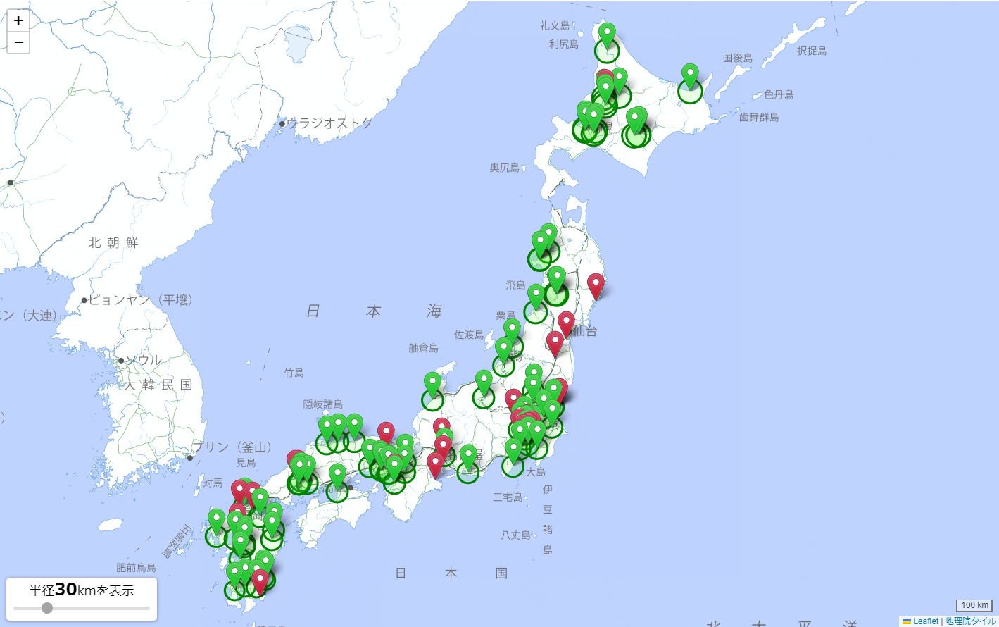

# ZeniKijunkyokuChecker
善意の基準局チェッカー

## 概要
RTKの利用に便利な[善意の基準局掲示板](https://rtk.silentsystem.jp/)と呼ばれるサービスがボランティアによって運営・管理されています。(RTKの説明については[RTKの概要の項](#rtkの概要)を参照してください。)

基準局の設置者は、自身の基準局を掲示板に登録することで、他のRTK利用者がその基準局を使用することができるようになります。これにより、公開されている基準局付近にいる人は移動局を用意するだけでRTKを利用することが可能になります。しかし、掲示板の内容が簡素な作りとなっており、基準局の位置が一目で分かりづらく、現在地から一番近い基準局の把握が難しい状況です。

そこで、当プロジェクトでは善意の基準局掲示板の情報をスクレイピングし、その情報を国土地理院の地図上にプロットしています。

### RTKの概要
RTK (Real Time Kinematic) とは、高精度な測位が必要な場合に用いられるGPS測位技術の一つです。通常のGPS測位では数十メートル単位での誤差が生じることがありますが、RTKでは基準局と移動局を使って、基準局から数10km範囲にある移動局では数センチメートル単位の高精度な測位が可能となります。基準局は測位誤差の少ない位置に設置され、その位置情報を移動局に送信して補正を行います。移動局は基準局から送られた情報をもとに測位を行い、高精度な測位結果を得ることができます。RTKは、測量や地図作成など、精度の要求が高い様々な分野で活用されています。

## 利用方法
[ここ](https://bolero-fk.github.io/ZeniKijunkyokuChecker/)から利用できます

## 開発環境
スクレイピング処理にはRubyが、チェッカーの表示にはHTMLとJavaScriptが使用されています。また、スクレイピング処理にはNokogiriが、地図の表示にはLeafletが使用されています。

## 詳細
基準局の情報を[善意の基準局掲示板](https://rtk.silentsystem.jp/)からスクレイピングし、その結果をリポジトリ保存しています。スクレイピング処理は毎日00:00にGitHub Actionsにより自動実行されます。

保存された基準局の情報を地図上にプロットしています。緑色のマーカーは公開中の基準局を示し、各マーカーから広がる円はその基準局からの距離を表しています。円の大きさは左下のスライダーで調整できます。一方、赤いマーカーは休止中の基準局を表します。各基準局の詳細は、マーカーをクリックすることで表示されます。

  
